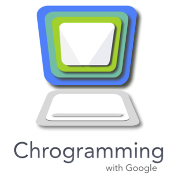

[](https://chrome.google.com/webstore/detail/coding-with-chrome/becloognjehhioodmnimnehjcibkloed)

Coding with Chrome
==================
[](https://codeclimate.com/github/google/coding-with-chrome)
[](https://travis-ci.org/google/coding-with-chrome)

<p align="center"></p>

Coding with Chrome is an Educational Development Environment built around two
core philosophies:
  1. Offer a stand-alone, offline app experience which allows people anywhere to
learn how to build useful computer programs:
    * A basic IDE able to support real programming work
    * A tutorial system that poses a challenge, checks the solution and
      provides feedback.

  2. Allow educators to put together a custom curriculum made up of various
components like:
    * input languages (blockly, javascript, coffeescript)
    * output modules (turtle graphics, javascript output, connected robots)
    * Flexible UI where elements can be easily added, modified or removed
    * Tutorial engine for self learning


## Licensing
Apache License, Version 2.0 see [LICENSE.md](LICENSE.md)


## Installing Coding with Chrome
If you only want to install __Coding with Chrome__, you could use the pre-compiled
version on the Chrome store.

1. Visit the [Chrome Web Store][1]
2. Click __Add to Chrome__
3. Go to [chrome://apps](chrome://apps) and launch __Coding with Chrome__


## What you need to build your own Coding with Chrome App
In order to build the Coding with Chrome App, you only need to have Node.js/npm.
If you want to clone/copy the Coding with Chrome App repo, you need git as well.

Each build is cross platform compatible. Which mean if you build the
Coding with Chrome App on Windows you could use the generated code
`genfiles/` folder on the other platforms like Mac OS X as well.


### Windows
Install Node.js from the official web page at https://nodejs.org
* Optional
  * Install git from the official web page at https://git-scm.com/
  * Install Java JRE

### Mac OS X
Install Node.js from the official web page at https://nodejs.org
* Optional
  * Install git from the official web page at https://git-scm.com/
  * Install Java JRE

### Linux/BSD
Use your package manager to install Node.js, or build from source.
* Optional
  * Use your package manager to install git, or build from source.
  * Install Open JDK or Java JRE


## How to build your own Coding with Chrome App

### Get the sources
Download the source files manual from GitHub or with git by running:
```bash
git clone --recursive git://github.com/google/coding-with-chrome.git
```

### Init / update submodules
In some cases you need to init and update the submodules manually by:
```bash
git submodule init
git submodule update
```

### Get required packages
Enter the "coding-with-chrome" directory and get the required packages by:
```bash
npm install
```

### Build and run the actual app
To compile and run the Chrome app use the following command:
```bash
npm run app
```
This will automatically build and start the application on Mac OS, Linux or
Windows.

### Build the actual app
To compile the Chrome app run the build script:
```bash
npm run build
```
The build version will be put in the `genfiles/` directory, together with all
required packages and files.


## How to load Coding with Chrome App manual in the Chrome Browser

### Enable developer mode
Visit `chrome://extensions` in your browser (or open up the Chrome menu by
clicking the icon to the far right of the Omnibox (three horizontal bars) and
select Extensions under the Tools menu to get to the same place).

Ensure that the Developer mode checkbox in the top right-hand corner is checked.

### Add the app
On the same page click `Load unpacked extension…` to pop up a file-selection
dialog.

Navigate to the directory in which your `genfiles/` files live, and select it.

Alternatively, you can drag and drop the directory where your `genfiles/` files
live onto chrome://extensions in your browser to load it.

### Launch the app
On the same page click `Launch` next to `Coding with Chrome` or visit
`chrome://apps` in your browser and click on the `Coding with Chrome` icon.


## Supported hardware and system

### Supported hardware
Computers and Laptops with Chrome OS or any OS which is able to run the
Desktop Chrome Browser are supported.
For additional features Bluetooth and/or USB are required.

### Supported systems
The following operating systems are supported by Coding with Chrome:
* Chrome OS
* Mac OS
* Windows OS
* Linux (without Bluetooth support / USB supported)

## Report Issues
For any issues or feature requests, we would really appreciate it if you report
them using our [issue tracker](https://github.com/google/coding-with-chrome/issues).


## Contributing

Contributing to Coding with Chrome is subject to the guidelines in the
[CONTRIBUTING.md](CONTRIBUTING.md) file, which, in brief, requires that
contributors sign the [Individual Contributor License Agreement (CLA)][2].

For more information about develop for Coding with Chrome, please check
[doc/DEVELOPMENT.md](doc/DEVELOPMENT.md)

### Translation
For translation instruction, please check [doc/I18N.md](doc/I18N.md).


## Credits
Coding with Chrome is made possible by other [open source software](NOTICE.md).

[1]: https://chrome.google.com/webstore/detail/coding-with-chrome/becloognjehhioodmnimnehjcibkloed
[2]: https://cla.developers.google.com/
